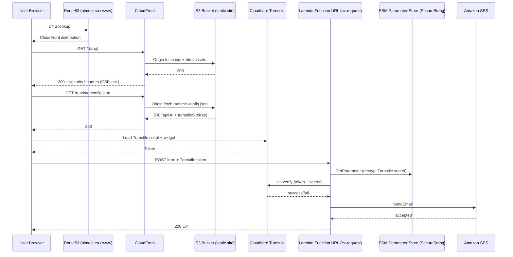

# aimeej.ca — portfolio + CV request form

[](#local-development)
[](https://react.dev/)
[](https://vitejs.dev/)
[](https://tailwindcss.com/)
[](https://aws.amazon.com/cdk/)
[](#deployment-production)

Personal portfolio site built with React + Vite and deployed as a low-cost AWS CDK stack:
- Static site: S3 + CloudFront (custom domain via Route53 + ACM)
- CV request form: Cloudflare Turnstile + AWS Lambda Function URL + SES email delivery

Live: `https://aimeej.ca`

## What’s In Here

- `src/`: React app (routes include `/cv` and `/contact`)
- `infra/`: AWS CDK app (S3, CloudFront, Route53 records, ACM cert, Lambda + Function URL, S3 deployments)
- `deployprd.txt`: production deploy script (build + `cdk bootstrap` + `cdk deploy`)

## Architecture (Call Diagram)



## Local Development

Prereqs:
- Node `>=22 <23` (see `package.json`)

Install + run:
- `npm install`
- `npm run dev`

Lint/build:
- `npm run lint`
- `npm run build`

### Local CV Form Testing

The `/cv` page expects:
- a Turnstile site key (public)
- a backend API URL (Lambda Function URL)

You can provide these locally via an uncommitted `.env.local`:

```bash
VITE_TURNSTILE_SITE_KEY=your_turnstile_site_key
VITE_CV_REQUEST_API_URL=https://your-lambda-url.on.aws/
```

## Deployment (Production)

### Prereqs

- AWS CLI configured (profile + region)
- Route53 hosted zone for `aimeej.ca` in the AWS account you deploy to
- SES configured in `ca-central-1`:
  - use a domain-based `FromEmail` (the stack creates SES domain identity + DKIM/Mail-From records)
  - if SES is in sandbox, also verify the recipient (`ToEmail`)
- Cloudflare Turnstile:
  - Site key: provided at deploy time
  - Secret key: stored in SSM Parameter Store (SecureString)
- DNS deliverability records:
  - CDK creates DKIM + MAIL FROM records via SES
  - CDK adds SPF + DMARC TXT records (merge if you already have SPF/DMARC)

### Configure Turnstile Secret (SSM)

Store the Turnstile secret key in SSM Parameter Store (SecureString) in `ca-central-1`:

```bash
aws ssm put-parameter \
  --name /aimeej/turnstile/secret \
  --type SecureString \
  --value "YOUR_TURNSTILE_SECRET_KEY" \
  --overwrite
```

### Deploy Script

Run the production deploy script:

```bash
TURNSTILE_SITE_KEY="YOUR_TURNSTILE_SITE_KEY" bash deployprd.txt
```

This script:
- builds the frontend into `dist/`
- deploys the CDK stack in `infra/`
- creates Route53 `A/AAAA` records for `aimeej.ca` and `www.aimeej.ca`
- uploads `runtime-config.json` (contains the Function URL + public Turnstile site key)

## Security Notes

- Turnstile token is verified server-side before sending email.
- Lambda enforces basic input validation and a payload size limit.
- Function URL CORS is restricted to the production domains (and localhost for dev).
- CloudFront sends security headers including CSP, `X-Frame-Options`, and `X-Content-Type-Options`.
